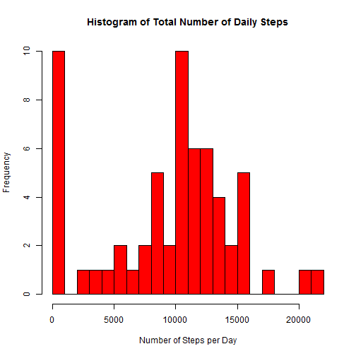
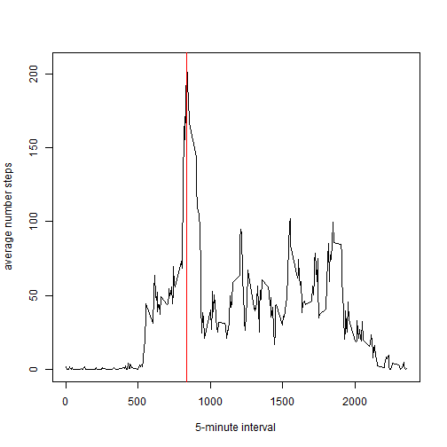
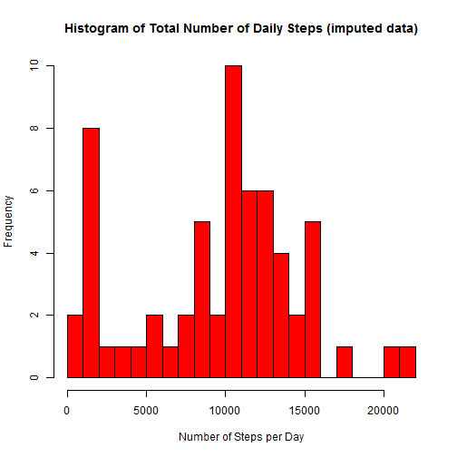
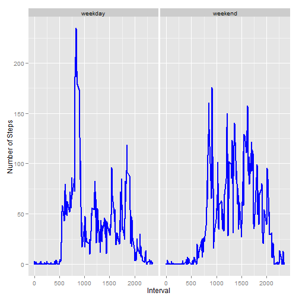

# Reproducible Research: Peer Assessment 1

##Loading and preprocessing the data


```r
activity_data <- read.csv("./data/activity.csv", stringsAsFactors=FALSE)

library(plyr)

activity_summ_data <- ddply(activity_data, c("date"), summarise, sum_steps = sum(steps, na.rm=TRUE), median_steps = median(steps, na.rm=TRUE))
```

##What is the mean total number of steps taken per day?

1.  histogram of the total number of steps taken each day

```r
hist(activity_summ_data$sum_steps, 
     main="Histogram of Total Number of Daily Steps",
     xlab="Number of Steps per Day",
     col="red", 
     breaks=25)
```

 


2. Calculate and report the mean and median total number of steps taken per day

```r
mean(activity_summ_data$sum_steps, na.rm=TRUE)
```

```
## [1] 9354
```

```r
median(activity_summ_data$sum_steps, na.rm=TRUE)
```

```
## [1] 10395
```

##What is the average daily activity pattern?
1. Make a time series plot (i.e. type = "l") of the 5-minute interval (x-axis) and the average number of steps taken, averaged across all days (y-axis)

```r
activity_data$interval_time <- sprintf("%04d", as.numeric(activity_data$interval)) 

activity_avg_data <- ddply(activity_data, c("interval_time"), summarise, avg_steps = mean(steps, na.rm=TRUE))

plot(x=activity_avg_data$interval_time, 
     y=activity_avg_data$avg_steps,
     type="l",
     xlab="5-minute interval",
     ylab="average number steps")

abline(v = activity_avg_data$interval_time[activity_avg_data$avg_steps==max(activity_avg_data$avg_steps)], col = "red",)
```

 

2. Which 5-minute interval, on average across all the days in the dataset, contains the maximum number of steps?

```r
most_active_5_min_interval <- activity_avg_data$interval_time[activity_avg_data$avg_steps==max(activity_avg_data$avg_steps)]

most_active_5_min_interval
```

```
## [1] "0835"
```

##Imputing missing values
1. Calculate and report the total number of missing values in the dataset (i.e. the total number of rows with NAs)

```r
sum(!complete.cases(activity_data)) 
```

```
## [1] 2304
```

2. Devise a strategy for filling in all of the missing values in the dataset. The strategy does not need to be sophisticated. For example, you could use the mean/median for that day, or the mean for that 5-minute interval, etc.

Will use the median for the 5-minute interval for the date

```r
activity_data_imputed <- activity_data

for (i in 1:nrow(activity_data_imputed)) {
    if (is.na(activity_data_imputed[i,1]) == TRUE) {
        activity_data_imputed[i,1] <- median(activity_data_imputed$steps[activity_data_imputed$interval==activity_data_imputed[i,3]], na.rm=TRUE)
    }
}
```
4. Make a histogram of the total number of steps taken each day 


```r
activity_imputed_summ_data <- ddply(activity_data_imputed, c("date"), summarise, sum_steps = sum(steps, na.rm=TRUE), median_steps = median(steps, na.rm=TRUE))

hist(activity_imputed_summ_data$sum_steps, 
     main="Histogram of Total Number of Daily Steps (imputed data)",
     xlab="Number of Steps per Day",
     col="red", 
     breaks=25)
```

 

..and Calculate and report the mean and median total number of steps taken per day. 


```r
mean(activity_imputed_summ_data$sum_steps, na.rm=TRUE)
```

```
## [1] 9504
```

```r
median(activity_imputed_summ_data$sum_steps, na.rm=TRUE)
```

```
## [1] 10395
```

Do these values differ from the estimates from the first part of the assignment?

* Only the mean differs.

What is the impact of imputing missing data on the estimates of the total daily number of steps?

* Median - remains the same
* Mean - has increased

##Are there differences in activity patterns between weekdays and weekends?

1. Create a new factor variable in the dataset with two levels - "weekday" and "weekend" indicating whether a given date is a weekday or weekend day.

```r
for (i in 1:nrow(activity_data)) {
    if(weekdays(as.POSIXct(activity_data[i,2])) %in% c("Sunday","Saturday")) {
          activity_data[i,"daytype"] <- "weekend"
    } else {
          activity_data[i,"daytype"] <- "weekday"
    }
}

activity_data$daytype <- sapply(activity_data$daytype,as.factor)
```

2. Make a panel plot containing a time series plot (i.e. type = "l") of the 5-minute interval (x-axis) and the average number of steps taken, averaged across all weekday days or weekend days (y-axis).

```r
activity_avg_data <- ddply(activity_data, c("interval","daytype"), summarise, avg_steps = mean(steps, na.rm=TRUE))

library('ggplot2')

par(mfcol=c(2,4))
ggplot(data=activity_avg_data, 
       aes(x=interval, y=avg_steps, group=daytype)) + 
       geom_line(size=1, colour="blue") + 
       geom_point(size=1, colour="blue") + 
       facet_wrap("daytype") +
       ylab("Number of Steps") +
       xlab("Interval")
```

 
